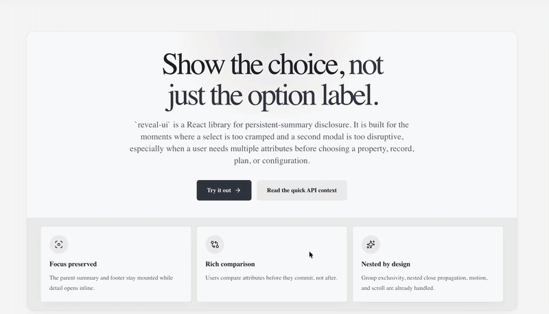

<p align="center">
  
</p>

# reveal-ui

<p align="center">
  Persistent-summary disclosure for inline reveal editors, expanding cards, and nested reveal flows in React.
</p>

<p align="center">
  <a href="https://github.com/HackEAC/reveal-ui/actions/workflows/ci.yml">
    
  </a>
</p>

`reveal-ui` is a React library for cases where a trigger-plus-panel pattern is too shallow. It keeps the top summary and bottom context mounted, then reveals richer content between them so users can inspect, compare, edit, or confirm without losing the surrounding workflow.

It is a good fit for inline editors, stacked cards, pricing or plan comparisons, nested edit flows, and chooser-style UIs where a short label is not enough to make the decision.

<p align="center">
  
</p>

## Install

```bash
npm install reveal-ui motion react react-dom
```

| Package | Required version | Notes |
| --- | --- | --- |
| `react` | `^19` | Peer dependency |
| `react-dom` | `^19` | Peer dependency |
| `motion` | `^12.34.5` | Needed only when you enable `magicMotion` |

## When To Use It

| Good fit | Skip it when |
| --- | --- |
| The summary should stay visible while detail opens inline | A normal accordion already preserves enough context |
| Users need multiple attributes before choosing or confirming | The interaction should block the app like a true modal |
| Nested flows need close propagation without modal chains | The content should unmount immediately with no phase-aware exit |
| Card stacks should behave like a single-open chooser | The detail is small enough for a plain tooltip or label |

## Quick Start

```tsx
import * as React from 'react'
import {
  RevealClose,
  RevealPanel,
  RevealTrigger,
  useRevealPanelState,
} from 'reveal-ui'

export function AccountRevealCard() {
  return (
    <RevealPanel
      keepMounted
      magicMotion
      restoreScrollOnClose
      scrollOnOpen
      content={({ phase }) => (
        <div className="border-t border-slate-200 px-5 py-4">
          <StatusLine phase={phase} />
          <div className="mt-4 flex items-center justify-between">
            <span className="text-xs uppercase tracking-[0.28em] text-slate-500">{phase}</span>
            <RevealClose className="rounded-full border px-3 py-1.5 text-sm text-slate-700">
              Done
            </RevealClose>
          </div>
        </div>
      )}
    >
      <RevealPanel.Top>
        <div className="rounded-t-3xl border border-slate-200 bg-white px-5 py-4 shadow-sm">
          <div className="flex items-center justify-between gap-4">
            <div>
              <p className="text-xs uppercase tracking-[0.28em] text-slate-500">Account</p>
              <h2 className="mt-2 text-lg font-semibold text-slate-950">Operating profile</h2>
              <p className="mt-1 text-sm text-slate-600">
                Persistent summary disclosure for inline editing.
              </p>
            </div>
            <RevealTrigger className="rounded-full bg-slate-950 px-4 py-2 text-sm text-white">
              Edit
            </RevealTrigger>
          </div>
        </div>
      </RevealPanel.Top>

      <RevealPanel.Bottom>
        <div className="rounded-b-3xl border border-t-0 border-slate-200 bg-slate-50 px-5 py-4 text-sm text-slate-600">
          Footer actions, metrics, or hints can stay visible below the reveal.
        </div>
      </RevealPanel.Bottom>
    </RevealPanel>
  )
}

function StatusLine({ phase }: { phase: string }) {
  const panel = useRevealPanelState()

  React.useEffect(() => {
    if (panel.phase !== 'opening' && panel.phase !== 'open') return
    const controller = new AbortController()
    fetch('/api/preview', { signal: controller.signal })
    return () => controller.abort()
  }, [panel.phase])

  return <p className="text-sm text-slate-700">Panel phase: {panel.phase ?? phase}</p>
}
```

## Composition Model

| Part | What stays mounted | What it is for |
| --- | --- | --- |
| `RevealPanel.Top` | Always | Summary, headline, trigger, current status |
| `content` | Opens and closes | The richer inline detail, editor, form, or comparison content |
| `RevealPanel.Bottom` | Always | Footer actions, metrics, hints, and surrounding context |

## Exports

| Export | Purpose |
| --- | --- |
| `RevealPanel` | Primary persistent-summary disclosure primitive |
| `RevealGroup` | Coordinates sibling exclusivity for single-open stacks |
| `RevealTrigger` | Explicit trigger with `aria-expanded`, `aria-controls`, and state attributes |
| `RevealClose` | Explicit close control that restores focus to the last trigger by default |
| `useRevealPanelState()` | Reads `phase`, `isOpen`, IDs, and open/close actions anywhere under a panel |

## RevealPanel Props

### Core props

| Prop | Type | What it does |
| --- | --- | --- |
| `content` | <code>ReactNode &#124; (renderProps) =&gt; ReactNode</code> | Primary revealed content slot |
| `revealContent` | <code>ReactNode &#124; (renderProps) =&gt; ReactNode</code> | Compatibility alias for `content` |
| `keepMounted` | `boolean` | Keeps the revealed subtree mounted through `closed` |
| `defaultOpen` | `boolean` | Initial state for uncontrolled usage |
| `open` | `boolean` | Controlled open state |
| `onOpenChange` | `(open: boolean) => void` | Change handler for controlled usage |
| `disabled` | `boolean` | Disables opening and closing interactions |
| `triggerAttr` | `string` | Attribute name used for delegated trigger nodes |
| `restoreAttr` | `string` | Attribute name used for delegated restore/close nodes |
| `autoSplit` | `boolean` | Splits children automatically when explicit top/bottom markers are absent |
| `closeSiblings` | `boolean` | Closes sibling panels when this one opens |
| `containTriggers` | `boolean` | Scopes delegated triggers to the current panel |
| `restoreFocusOnClose` | `boolean` | Returns focus to the last trigger when closing |
| `regionLabel` | `string` | Accessible label for the revealed region |

### Scroll and motion props

| Prop | Type | What it does |
| --- | --- | --- |
| `scrollOnOpen` | `boolean` | Scrolls the panel into view when it opens |
| `restoreScrollOnClose` | `boolean` | Restores the primary scroll target captured during open as the panel closes |
| `scrollContainer` | <code>HTMLElement &#124; null &#124; (() =&gt; HTMLElement &#124; null)</code> | Primary scroll target |
| `scrollCascade` | `Array<{ container; offset?; mode?; padding? }>` | Optional outer container alignment steps during open-time scroll alignment |
| `scrollOffset` | `number` | Top offset used during automatic scroll alignment |
| `scrollDurationMs` | `number` | Scroll animation timing |
| `magicMotion` | `boolean` | Enables `motion/react` layout transitions |
| `parallaxOffset` | `number` | Controls reveal translation depth |
| `revealBlurPx` | `number` | Applies blur during motion-enabled transitions |
| `scrollOvershootPx` | `number` | Adds overshoot during automatic scroll alignment |
| `scrollSpacerTarget` | <code>'self' &#124; 'container' &#124; 'none'</code> | Chooses where extra scroll space is attached |

## Render Props And Close Options

### `content` render props

| Field | Type | What it does |
| --- | --- | --- |
| `open()` | `() => void` | Opens the panel from inside the subtree |
| `close(options?)` | `(options?: CloseOptions) => void` | Closes the panel and can optionally propagate or skip focus restore |
| `isOpen` | `boolean` | Current open state |
| `phase` | <code>'closed' &#124; 'opening' &#124; 'open' &#124; 'closing'</code> | Current lifecycle phase |
| `contentId` | `string` | Stable ID for the revealed region |
| `triggerId` | <code>string &#124; undefined</code> | Stable ID for the active trigger when one exists |

### `close()` options

| Option | Type | Effect |
| --- | --- | --- |
| `propagate` | `boolean` | Bubbles the close request to outer panels |
| `restoreFocus` | `boolean` | Overrides focus restoration for this close call |

## Lifecycle And Accessibility

| Concern | Behavior |
| --- | --- |
| Lifecycle phases | `closed`, `opening`, `open`, and `closing` are exposed through render props and `useRevealPanelState()` |
| Region semantics | The revealed subtree uses `role="region"` and binds to the active trigger when possible |
| Explicit controls | `RevealTrigger` and `RevealClose` expose `data-state`, `data-phase`, and `data-disabled` |
| Delegated controls | Non-button delegated triggers receive button semantics, focusability, and ARIA wiring |
| Focus return | Closing restores focus to the last trigger unless disabled globally or per close call |
| Reduced motion | Motion and coordinated scroll timing simplify automatically in reduced-motion environments |

## Upgrade From Older Prereleases

`RevealSplitter` has been removed from the public package surface. If older prerelease code imported it, rename that import to `RevealPanel`.

```tsx
// Before
import { RevealSplitter } from 'reveal-ui'

// After
import { RevealPanel } from 'reveal-ui'
```

## Validation

| Command | Purpose |
| --- | --- |
| `npm run lint` | Static checks with Biome |
| `npm run test` | Unit and docs-surface tests |
| `npm run test:coverage` | Generates coverage output for CI and Codecov |
| `npm run typecheck` | TypeScript validation |
| `npm run build` | ESM, CJS, and type output |
| `npm run pack:dry-run` | Shows the exact npm tarball contents |
| `npm run smoke` | Installs the packed tarball into a clean temp consumer and verifies `require()` and `import()` |
| `npm run ci` | Full release gate used before publish |

## Local Example

The repository includes a small Next.js consumer in `examples/next-app`.

```bash
npm run docs:install
npm run docs:preview
```

- Repository: [github.com/HackEAC/reveal-ui](https://github.com/HackEAC/reveal-ui)
- Website: [hackeac.github.io/reveal-ui](https://hackeac.github.io/reveal-ui)

## License

MIT
